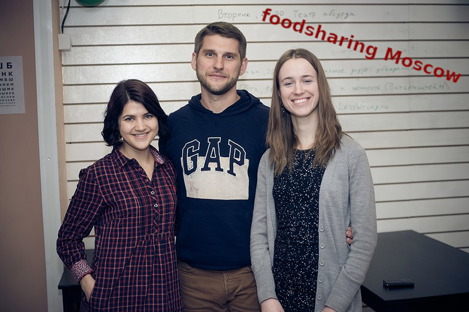
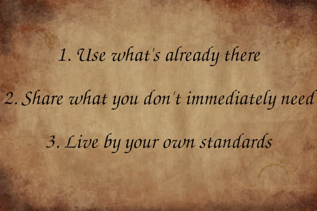
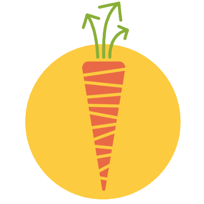

# The foodsaving grassroots movement

_the authors_

---

# Agenda

1. Introduction
2. Deep-dive
3. ...

---

# Introduction

_nothing here yet_

---

layout: true

  

---

# A moral and ecological catastrophe

* around a billion malnourished people
* hunger kills more than AIDS, malaria and tuberculosis combined
* no shortage of food
* industrialised food production wastes food at every level
* huge emissions of greenhouse gases
* more consumer waste in more developed countries

???

Food waste is a massive moral scandal and an ecological catastrophe of staggering proportion.

There are around one billion malnourished people in the world and more people die from hunger than from AIDS, malaria and tuberculosis combined.

Yet we waste an amount of food that would feed all of them. We don't have a food shortage.

Food waste occurs at every stage along the supply chain for many reasons such as inadequate storage facilities, excessive cosmetic demands, consumer uncertainty over expiry dates, surplus production ensure contractual obligations are met, changing supermarket product lines, labelling errors, forecasting errors, excessive portion sizes, fears over health risks and much more.

Many of these reasons can be attributed to our industrialised food production systems that normalise overproduction and waste in a drive to maximise profit - by comparison subsistence farmers and households in sub-Saharan Africa waste almost nothing.

There is also a huge ecological impact from harvesting, processing, transporting, cooling, and cooking food, only to dump it in landfill where significant levels of methane and carbon dioxide are emitted.

Were food waste represented as it's own country it would be the worlds 3rd largest emitter of greenhouse gases behind the USA and China.  It represents a quarter of all freshwater consumption and the land used to produce the food would be about the same size as China and the EU combined.

In poorer countries more food is wasted during the harvesting, transportation, and storage. As countries get more economically advanced, the waste shifts to the consumer end where the environmental impact is worse having gone through more layers of the supply chain.  Around 50% of food waste in developed countries is consumer waste - as we get richer as individuals, we waste more.

Now I'll look at how four types of organisations approach the issue.

---

# [Inter]Government organisations

* much increased focus in the last 10 years
* UN Sustainable Development Goal 12.3
* approach: "target, measure, act"
* when do we act?
* need more than just reports and recommendations

???

Government and Intergovernmental organisations

Ten years ago the problem of food waste in the EU was focused on composting and digesting bio waste. Within the last ten years the UN, the EU, and various Governments have put 10s, if not 100s, of millions of euros towards tackling the problem.

In 2015 the UN Sustainable Development Goals were created including goal 12.3 - "By 2030, halve per capita global food waste at the retail and consumer levels and reduce food losses along production and supply chains, including post-harvest losses"

X The EU have a created numerous projects, platforms, working groups, and reports concerning food waste.

The high level approach is to "target, measure and act" but I fear they get stuck in the bureaucratic process of trying to define and measure everything. After years working on definitions of what "food" and "waste" actually is a UN speech earlier this year in New York announced that "The first reporting by Member States is foreseen in 2022.". The UN indicator for the food waste goal says that "No data for this indicator is currently available and its methodology is still under development". If it takes 7 years to start measuring the problem, how much longer will it take to actually solve it?

Back in 2016 a report from the European Court of Auditors reported that:
> the [EU] Commission’s action at a technical level has been limited to establishing working and expert groups

A UN report this year says:
> ... despite evident progress on the  development  of  policies, knowledge  resources  and  technical  tools,  the  application  and implementation of these to foster concrete and tangible changes in practices and impacts remains limited

They report being seriously under resourced.

They are also perhaps working against the Sustainable Development Goal 8 which is to continue with economic growth, and will presumably create yet more wasteful consumers.

In 2016, France got a lot of praise for requiring supermarkets to give surplus food to charity, however it comes with certain limitations:
> ... if the supermarket signs an agreement to donate 1 % of such food, it is already complying with the law
> A study showed that in one province less than 24% of total surplus food ended up with the partner charities
> Supermarkets and their partner charities are in dire need of better redistribution services.

Solving the problem needs not just high level policies and recommendations but a huge network of real people and organisations that are geared up to receive the food, food waste can't be solved from a office.

X The ability and willingness of the state to achieve this is far from certain with the often conflicting interests of businesses to support and massive budget constraints.

---

# Big Charity

* fix the problems the state or market can't or won't
* now intertwined with state and market
* stigma and shame of receiving from charity
* short term measures of impact miss the point

???

Big Charity

The traditional solution, at least in the UK, is big charity, large, widely known organisations that deal with the problems created by our society - homelessness, hunger, poverty, illness, etc. Their job is take take care of the issues that fall between the gaps of state and the market. They often depend on governments for their substantial funding needs, but these increasingly corporate organisations have come under scrutiny lately.

A recent independent two year study by Civil Society Futures puts it like this: "Professionalised, brand-driven and beholden to government for their multi-million contracts and big business for their ‘partnerships’, charities are seen to have become part of the very system they were set up to challenge."

This is highlighted by the 2014 UK law known as the "gagging law" that restricts the ability of charities to campaign on political topics in the run up to an election, and this year charities involved in back to work programmes had to sign gagging clauses preventing them from criticising the government.

Government grants have become more like government contracts, and the organisations dependent on them become extensions of the state, tied to the objectives, ideologies, and whims of that state. Unaccountable to the people or communities actually impacted or involved.

Food banks are one that surplus food can be redistributed, and a study in the Netherlands explored the emotional impact of receiving food from food banks. They found people experienced stigma and shame when using the service and realising their position at the bottom of the social hierarchy. They suggested it can more about satisfying the spiritual needs of the person donating the food and less about the needs of the person receiving the food.

Giving the poor our leftover scraps is not an adequate response to systemic poverty. It's an "us and them" mentality that disempowers people.

And in the words of the Civil Society Futures report: "too often ... size, turnover and short-term measures of impact are treated as the best measures of success ... real and long-lasting success comes from the depth and breadth of connections with people and communities, and the opportunity for everyone involved to have some power."

My sister has worked in the charity sector for over 30 years and when discussing the recommendations from the Civil Society Futures report with her she laughed and told me people have been writing reports saying this kind of thing her whole career.

Maybe to actually implement these ideas we need to look beyond the charity sector. Let's have a look what's happening in the private sector...

---

# Startups

* €143 billion cost of food waste in EU
* venture capital, users, profit
* rely on people
* can we solve problems and profit?

???

Startups

The cost of food waste has been estimated at 143 billion euros in the EU alone. A number of startups have popped up in recent years such as Olio, Too Good To Go, and Karma to try and unlock some of that as profit. The standard model is to attract venture capital, grow the user base, then find a way to extract profit and between these three they have raised at least thirty five million euros to do that. Their websites tell you how they are fighting food waste, saving the environment, and making the world a better place but fundementally their purpose is to generate profit for the founders and the investors.

They sometimes appear as community organisations where you can do your bit for society and they rely on building a network of users and volunteers, but you have no actual control, share of the profit, or ownership in the company. The data, algorithms, and business strategies are locked behind a layer of propriety software beyond scrutiny. More "us and them" mentality.

Capitalism, through our industrialised food production systems, has created many of our food waste problems and leaving it to capitalism to solve them is risky when profit will always be the first priority. And we have countless examples of businesses that show a systematic disregard for any other interest - workers rights, users privacy, environmental impact, or legitmate community concerns.

They may also have the perverse incentive to actually increase food waste. The more food waste there is the bigger the market there is to expand into. The bottom line is profit, not reduction of food waste.

X It's a shift from a sharing mindset to a market mindset.

To build a stronger more resilient society that can solve problems we need another approach.

---

# A task for the community

* part of a wider change
* not waiting for permission or a plan
* participatory not passive consumerism
* need supportive software tools

???

A task for the community

We recognise that preventing food waste is not an isolated problem in need of a narrow targeted solution, but can be solved as part of a wider cange in society.

The Civil Society Futures report described the need for "a radical and creative shift that puts power in the hands of people and communities, preventing an ‘us and them’ future, connecting us better and humanising the way we do things." ... and that it's about ... "not waiting for permission, or hoping others will provide a plan".

To break free from the limitations of the state or the market we need to build community-led organisations that are encourage self-help, self-responsibility, democracy, equality, equity and solidarity. We need to move away from passive consumerism and believing our systems and structures will take care of societies problems. Community groups, activists, solidarity economies, transition towns, and co-operatives are leading the way.

You'll hear from Janina later about how these community approaches are being used to collect surplus food from supermarkets and to allow neighbours to share food and organise community meals.

? And that once communities are built they don't stop at one topic but hang out with others to form a network of communities tackling whichever topics they see need solving.

And these approaches can also be used to improve our food supply chains directly through food buying co-ops, community supported agriculture, and local food growing inititives.

We need software tools that support these organising methods, and existing tools like Facebook groups don't cut it. They aren't built with or for transparency, freedom, democracy, or paticipation, they encourage passive clicktavism mindsets and you're competing with their main goal of getting clicks to advertisers.

With new software tools we need the development process itself to embody the same values, to be inclusive, democratic, and participatory or we risk rebuilding the hierarchies and structures we're trying to get away from.

---

# foodsharing.de

???
- one solution already in place is foodsharing.de
- biggest volunteer-based foodsaving initiative there is
- some idealist dumpster diver 7 years ago
- absurd to rummage through trash to then find so much edible food that it's possible to live off it exclusively
- approached store owners, found some who agreed that it's a shame
- agreed on fixed times at which volunteers could pick up the surplus
- soon there were more stores, more volunteers
- distribution needed, because foodsavers themselves couldn't eat it all
- it all got quite complex pretty fast
- so a foodsaver who happened to be a developer created an online platform
- to help with the organizational bits

---

# foodsharing.de · Figures

- 50.000 foodsavers
- 5.000 cooperating stores
- 600 publicly accessible food-share point
- a team of volunteer coders

???
- and today we have:
- 50.000 foodsavers
- 5.000 cooperating stores
- 600 publicly accessible food-share point
- a team of volunteer coders who keeps foodsharing.de running

---

# foodsharing.de · Golden rules

  

???
- the golden rules are: (see slide)
- this means that the foodsavers themselves can decide what to do with the saved food as long as it's gonna be eaten
- simple, positive, direct and empowering
- it's just natural to spread it further and further
- It already grew beyond the borders of Germany years ago
- nowadays extends more and more into areas where no German is spoken
- foodsharing.de - which is available in German only - cannot be used there
- but really, you don't need software to get started

---

# What software doesn't do

  
  <b style="margin-top: 200px">vs.</b>
  

???
- software doesn't help you build a real-life network of people
- what's needed is some time, some ideas and some determination to make this work
- get off your chair and out into the real world
- talk to people about food waste, form a first small group of like-minded individuals and gather the courage to contact stores at eye level
- may not be the easiest thing, but can theoretically be started tomorrow
- no need to ask someone for permission
- you can just take matters into your own hands and get active!
- but you don't need to get active alone...

---

# Yay community! :D

  

???
- in fact, you need people coming together for this to work
- in the end you need a whole community of foodsavers and eaters to make use of all the saved food
- so you want a good community spirit so that ppl want to come back
- and you want a core group of friends to coordinate everything
- cos everything is more fun if you do it together with friends
- and what is more fun is more stable, because you _like_ doing it

---

# How to find friends

  

???
- so how to find this core group of friends? How do people become friends?
- getting to know each other, spending time together and finding out to have something in common
- foodsaving offers all this through a common goal and a plan!
- Start with info events and communal cooking to spread the word, continue with building FSPs and cooperations
- for starters core group of maybe 5 foodsavers is more than enough
- if everyone is a bit open and friendly you will most definitely get along
- the more time you spend, the stronger your bond will grow
- So many things you can - and should! - do:
- Hangouts, brunches, communal cooking, movie screenings
- activities that are fun _and_ pr at the same time

---

# With a core group...

  

???
- everything's gonna be much easier
- You can share workloads and develop plans together,
- you can exchange ideas and form synergies,
- you can save food and have a jolly good time while at it.
- Foodsaving becomes a hobby and a lifestyle, something you just _do_
- underlying environmental and social reasons create a culture that can more easily spread and maintains itself
- Leads to more people feeling motivated and empowered to get further involved
- Leads to even more possible growth via more pr: info stands, distribution events, festival participation

---

# Catalyst effect

  

???
- Food waste is just one of many issues in this absurd world we live in today
- When people become foodsavers, they're normally interested in making the world a better place,
- when they participate for a while, they learn that they actually _can_ make a change
- positive, productive and practical environmental activists
- many similar topics in the sense of zero waste, upcycling, repairing and general environmentalism become obvious
- so do the many more similar forms of countering these, like:
  - Organizing free shops and free markets, clothes sharing parties, repair cafes, skill sharing sessions, etc.

---

# Internalization

  

???
- by living this logic for a while people's view of the world can change
- they might start basing their actions on these three values:

- 'use what's already there'
  - get active to find it, to understand it, to make it accessible and useful again
- 'share what you don't immediately need'
  - regain control over your desires, conquer your greed, understand that you are not your possessions
- 'live by your own standards'
  - reject normality as a value in itself, form independent opinions

- This is basically the description of an eco hacker, don't you agree?
- So how does it work to spread this mindset?

---

# User story: foodsharing Östersund

  
  
Some months later:

  

???
- Normally it goes somewhat like this:
- Teddy from Germany is a very active foodsaver going to Sweden for her studies
- She wants to spread the idea of foodsaving in her new city Östersund (50k inhabitants)
- She holds two info events to gather like-minded people, where only 4-6 people show up
- She creates two facebook groups to gather interested people and fellow foodsavers respectively
- She contacts stores to build up cooperations
- She contacts us and asks for help setting up a group on Karrot
- our pickup management tool Tilmann will tell you more about in a second
- As soon as the cooperations are established the stores and pickups are put up on Karrot and people can sign up there
- Over the coming months a community forms, more cooperations are built and lots of food is saved
- In three weeks Teddy will leave Östersund because her study time there is over, but look what she leaves behind:
- 200 foodsavers in the Karrot group
- 5 cooperating stores, 2 of which are supermarkets

---

layout: true

  

---
class: big
# Karrot

Our foodsaving tool and community organizer!

  
  

???
Karrot is our contribution to help foodsaving groups grow.
It's a web app that gives each group their own space for organizing.
We have desktop and mobile versions, because we are often on the road when we save food.

In one sentence: think of it as a combination of a collaborative calender and a messaging system.

Now let's look a bit deeper what we can do on Karrot.

---
background-color: black
background-image: url(images/karrotost.png)
background-size: 90%

???
First, someone will create a group. Here's how the group start screen looks.
Then, they enter details about their co-operations, where and when they happen, if they happen regularly, how many people are needed and so on.

There's a list of food pickups and people can sign up for them.
As you can see here, all slots are already filled, which is very good!

We can also write messages to the whole group, to individual users or to those we do food pickups together with.

After doing the food pickup, we can give feedback how it went and how many kilos we saved.
This helps to spread information amongst team members.
We also get meaningful statistics.

To grow our group, we can invite others via email or let them apply for the group.
We can chat with them and invite them for a meeting in real-life before we accept them into the group.

---

# Karrot · Our goals

- serve many groups in different countries
- encourage do-ocratic participation
- let people work together

???
"Why is Karrot the way it is?"

When we work on Karrot development, our search for the best solution is guided by these goals.

We want to provide useful software for multiple groups which are different in many ways.
They come from different countries and have different rules, different language.

We want to encourage participation in groups, from all members.
Our model for this is "do-ocracy":
do something if you think it should be done and be excellent to each other.

We want to let people work together.
Our assumption is that people want to work together to make something great.
We want to make sure they can do that and no getting interrupted by destructive actions.

---

# Example: Group membership

  

???

"what's an example of the special karrot way?"

There are many design decisions in Karrot that I would like to talk about.
But there's not enough time in this talk, so I will just highlight one topic.
The group membership progress.

- you apply to join group
- group members interview you
- (your accept rules, you come to a real-life meeting)
- group member accepts your application
- you are newcomer
- you do pickups, meet people, give feedback
- others trust you
- you gain editing rights
- you set up new co-operations and drive the group forward

Newcomers have only limited rights until they gained the trust of other group members.
Active long-term members should all become editors.

This design has been inspired by the trust level of the Discourse forum software.

---

# Karrot · Comparison

  

Karrot has:

- independent groups
- multi-language and localization
- self-managing trust-based hierarchy
- feedback about pickups

???

"isn't there other software that does the same thing?"

Karrot has drawn a number of inspirations from other software.
Our main inspiration was foodsharing.de, with its dense network of foodsharing groups in German-speaking regions.
We made significant modifications to adapt it for worldwide use:

First, all groups are independent from each other.
This allows them to set their own rules, because the social and legal context of every country is different.

We added localization support, so that groups can use Karrot in their own language and timezone.

We use a self-managing trust-based hierarchy instead of manually assigning admin roles.

We added a system to provide feedback about food pickups.

---

# Karrot · Development

- our users actively give feedback and help with setting priorities
- unfunded
- no one except the developers and the users have a say on what should be done
- supported by saved food and various hackbases (&rarr; Kanthaus)

???

"how did you achieve it?"

...

--

## In future

- groups to spend some of their funds on Karrot
- formalize cooperative structure for development and karrot.world

???

...

---

# Karrot · Progress

- started in 2016
- has active users since mid-2017
- currently 16 active groups in 9 countries with 500 active users
- 50 food pickups per day

???

"what is the current state of Karrot?"

--

500 users in two years?

&rarr; fail! - _if we were a startup..._

But: **these people go out and save food every day!**

???

Startup: move fast and break things
Resilience: move slow and make things

---

# Karrot · Generalization

We can do more than foodsaving:

- bike saving &rarr; _Bike kitchen_ movement
- wood saving
- fruit from trees
- elderly care
- child care

???

"Can other fields benefit from Karrot as well?"
...

---
class: big
# Karrot · join us!

* our assembly &rarr; Hall 2, Kanthaus
* community forum &rarr; [community.foodsaving.world](https://community.foodsaving.world)
* foodsaving community stories &rarr; [foodsaving.today](https://foodsaving.today)
* start a group! &rarr; [karrot.world/#/group/create](https://karrot.world/#/group/create)
* contribute! &rarr; [github.com/yunity/karrot-frontend](https://github.com/yunity/karrot-frontend) <small>(Django, Vue)</small>

???

...
