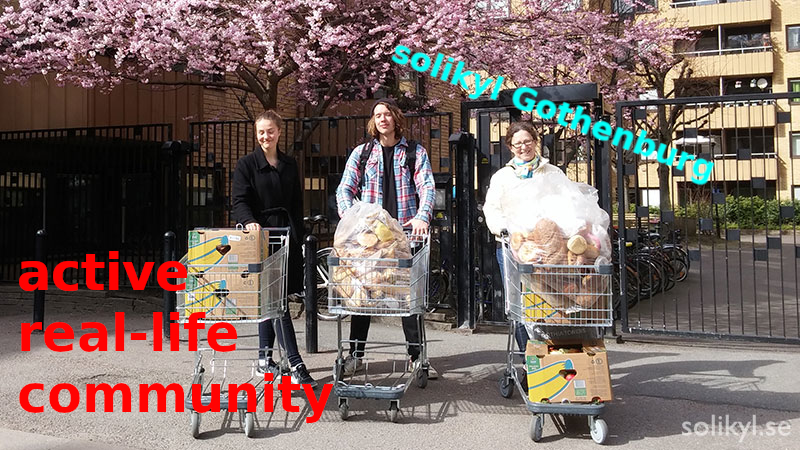
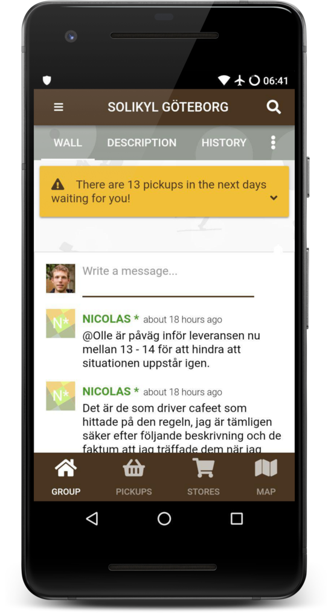

# The foodsaving grassroots movement

_the authors_

---

# Agenda

1. Introduction
2. Deep-dive
3. ...

---

# Introduction

* the problem of food waste approaches for dealing with it
* foodsaving communities
* karrot

---

layout: true

  

---

# A moral and ecological catastrophe

* around a billion malnourished people
* hunger kills more than AIDS, malaria and tuberculosis combined
* 1/3 of food is wasted globally
* why is food wasted?
* ecological catastrophe
???

* around a billion malnourished people
  * moral disaster
* hunger kills more than AIDS, malaria and tuberculosis combined
* 1/3 of food is wasted globally
  * up to 50% in some estimates
  * enough to feed all
  * we've built a supply chain that maximises profit and normalizes waste
  * subsistence farmers and households in sub-Saharan Africa waste almost nothing
* why is food wasted?
  * apples that aren't round enough
  * a box of eggs thrown out because one has broken
  * contracts that need supplies overproduction
  * the packaging has broken
  * the label is printed wrong
* ecological catastrophe
  * huge emissions of greenhouse gases
  * impact production + landfill is massive.
  * if it were a country ...

---

???

* also
  * a quarter of all freshwater consumption
  * land use = China and the EU combined
  * more economic development more consumer waste

* so, how do we solve it?

---

# [Inter]Government organisations

* now recognised at high levels
* approach: target &rarr; measure &rarr; act
* UN Sustainable Development Goal 12.3
> "By 2030, halve per capita global food waste at the retail and consumer levels"

???

* now recognised at high levels
  * last 10 years recognized the problem UN, EU
  * 10s if not 100s of millions of euros into it
* approach: target &rarr; measure &rarr; act
* UN Sustainable Development Goal 12.3
> "By 2030, halve per capita global food waste at the retail and consumer levels"

--

## ... but

* get stuck trying to measure?
* too many working groups, committees, reports, not enough tangible change
* need people and organisations

???

sounds good like they're taking care of it but ...
* get stuck trying to measure?
  * what does food or waste even mean
  * UN speech "The first reporting by Member States is foreseen in 2022."
  * 7 years to report, how long before we act?
* EU and UN reports
  * underfunded
  * policies, knowledge resources, technical  tools, working groups and expert groups
  * little tangible impact, UN: "impacts remains limited"
* need people and organisations
  * 2016 france outlawed food waste, but lacks infrastructure to collect it
  * not solved from an office

---

---

# Big Charity

* there to fix state/market problems
* collect food and redirect to food banks and community cafes

???

* there to fix state/market problems
  * fix the problems the state or market can't or won't
  * seems perfect for food waste
* collect food and redirect to food banks and community cafes
  * professional food handlers, regulated and trained

--

## ... but

* stigma of living from charity
* now intertwined with state and market
* short term measures of impact miss the point

???

... but
* stigma of living from charity
  * want: dignity, independence, empowerment
  * netherlands study food bank emotions:
    * appreciated food but
    * the shame of being "bottom of the social hierarchy"
  * not approach to solving systemic poverty
* now intertwined with state and market
  * recent report about state of civil society
    * "charities are seen to have become part of the very system they were set up to challenge"
  * grants -> contracts
  * UK: laws setup to prevent criticism of the government
  * accountable to their funders, not people and communities
* short term measures of impact miss the point
  * "size, turnover and short-term measures of impact"
  * long term "connections with people and communities... everyone involved to have some power"
  * sister 30+ years, laughed at recommenations, seen reports like this

* look beyond charity sector, see private sector

---

# Startups

* food waste costs €143 billion in EU alone
* startup model: venture capital, lots of users, business model
* business models: charge to collect waste, sell food, advertising/promotions

???

* food waste costs €143 billion in EU alone
* startup model: venture capital, lots of users, business model
  * 10s of millions in funding to do this
  * profit
* business models: charge to collect waste, sell food, advertising/promotions
  * models:
    * charge to collect
    * let them sell + commission
    * advertising, promotions

--

## ... but

* exploitative labour
* real mission: profit

???

... but

* exploitative labour
  * rely on huge network of people, users volunteers
  * no control, ownership, profits extracted back to investors
  * heart of the business locked away from scrutiny 
* real mission: profit
  * fighting food waste, saving the environment, making the world a better place
  * profit for founders and investors, mission creep
  * good intent, but... when it comes to it instead of being accountable to ...

---

---

<small class="attribution">CC0 Photo by mentatdgt from Pexels</small>

???
Don't want to be accountable to...

What's left? resilient communities...

---

# A task for the community

* part of a wider change for civil society
> "a radical and creative shift that puts power in the hands of people and communities, preventing an ‘us and them’ future, connecting us better and humanising the way we do things." 
> "not waiting for permission, or hoping others will provide a plan"
* democratic and participatory
* the world is in _our_ hands

???

* part of a wider change for civil society
  * food waste not isolated problem
  * Civil Society Futures report
* democratic and participatory
  * people are involved
  * have control of tools, software
  * share power
  * move away from social hierarchy, no us and them
  * active not passive consumers
* the world is in _our_ hands
  * as seen, nobody is coming
  * systems and structures fail us
  * we can use/learn from:
    * community and activist groups
    * solidarity economies
    * transition towns
    * co-operatives
  * empower ourselves to act, don't take 7 years

Let's see how these ideas apply to saving food.

---

<small class="attribution">By OpenIDUser2 - GFDL, https://commons.wikimedia.org/w/index.php?curid=26747239</small>

---

# foodsharing.de

pictures by foodsharing.de

???
- one solution already in place is foodsharing.de
- biggest volunteer-based foodsaving initiative there is
- some idealist dumpster diver 7 years ago
- absurd to rummage through trash to then find so much edible food that it's possible to live off it exclusively
- approached store owners, found some who agreed that it's a shame
- agreed on fixed times at which volunteers could pick up the surplus
- soon there were more stores, more volunteers
- distribution needed, because foodsavers themselves couldn't eat it all
- it all got quite complex pretty fast
- so a foodsaver who happened to be a developer created an online platform
- to help with the organizational bits

---

# foodsharing.de · Figures

- 50.000 foodsavers
- 5.000 cooperating stores
- 600 publicly accessible food-share point
- a team of volunteer coders

???
- and today we have:
- 50.000 foodsavers
- 5.000 cooperating stores
- 600 publicly accessible food-share points
- a team of volunteer coders who keeps foodsharing.de running

---

# foodsharing.de · Golden rules

  

???
- the golden rules are: (see slide)
- this means that the foodsavers themselves can decide what to do with the saved food as long as it's gonna be eaten
- simple, positive, direct and empowering
- it's just natural to spread it further and further
- It already grew beyond the borders of Germany years ago
- nowadays extends more and more into areas where no German is spoken
- foodsharing.de - which is available in German only - cannot be used there
- but really, you don't need software to get started

---

# What software doesn't do

  
  <b style="margin-top: 200px">vs.</b>
  

all pictures by the respective groups or cc0

???
- cause what software doesn't do is,
- it's not gonna transform a lonely computer person into part of an active real-life community
- software doesn't build a physical network of people for you
- what's needed is some time, some ideas and some determination to make this work
- get off your chair and out into the real world
- talk to people about food waste, form a first small group of like-minded individuals and gather the courage to contact stores at eye level
- may not be the easiest thing, but can theoretically be started tomorrow
- no need to ask someone for permission
- you can just take matters into your own hands and get active!
- but you don't need to get active alone...

---

# Yay community! :D

  

???
- in fact, you need people coming together for this to work
- in the end you need a whole community of foodsavers and eaters to make use of all the saved food
- so you want a good community spirit so that ppl want to come back
- and you want a core group of friends to coordinate everything
- cos everything is more fun if you do it together with friends
- and what is more fun is more stable, because you _like_ doing it

---

# How to find friends

  

???
- so how to find this core group of friends? How do people become friends?
- getting to know each other, spending time together and finding out to have something in common
- foodsaving offers all this through a common goal and a plan!
- Start with info events and communal cooking to spread the word, continue with building FSPs and cooperations
- for starters core group of maybe 5 foodsavers is more than enough
- if everyone is a bit open and friendly you will most definitely get along
- the more time you spend, the stronger your bond will grow
- So many things you can - and should! - do:
- Hangouts, brunches, communal cooking, movie screenings
- activities that are fun _and_ pr at the same time

---

# With a core group...

  

???
- everything's gonna be much easier
- You can share workloads and develop plans together,
- you can exchange ideas and form synergies,
- you can save food and have a jolly good time while at it.
- Foodsaving becomes a hobby and a lifestyle, something you just _do_
- underlying environmental and social reasons create a culture that can more easily spread and maintains itself
- Leads to more people feeling motivated and empowered to get further involved
- Leads to even more possible growth via more pr: info stands, distribution events, festival participation

---

# Catalyst effect

  

???
- Food waste is just one of many issues in this absurd world we live in today
- When people become foodsavers, they're normally interested in making the world a better place,
- when they participate for a while, they learn that they actually _can_ make a change
- positive, productive and practical environmental activists
- many similar topics in the sense of zero waste, upcycling, repairing and general environmentalism become obvious
- so do the many more similar forms of countering these, like:
  - Organizing free shops and free markets, clothes sharing parties, repair cafes, skill sharing sessions, etc.

---

# Internalization

  

???
- by living this logic for a while people's view of the world can change
- they might start basing their actions on these three values:

- 'use what's already there'
  - get active to find it, to understand it, to make it accessible and useful again
- 'share what you don't immediately need'
  - regain control over your desires, conquer your greed, understand that you are not your possessions
- 'live by your own standards'
  - reject normality as a value in itself, form independent opinions

- This is basically the description of an eco hacker, don't you agree?
- So how does it work to spread this mindset?

---

# User story: foodsharing Östersund

  
  
Some months later:

  

???
- Normally it goes somewhat like this:
- Teddy from Germany is a very active foodsaver going to Sweden for her studies
- She wants to spread the idea of foodsaving in her new city Östersund (50k inhabitants)
- She holds two info events to gather like-minded people, where only 4-6 people show up
- She creates two facebook groups to gather interested people and fellow foodsavers respectively
- She contacts stores to build up cooperations
- She contacts us and asks for help setting up a group on Karrot
- our pickup management tool Tilmann will tell you more about in a second
- Over the coming months a community forms, more cooperations are built and lots of food is saved
- In three weeks Teddy will leave Östersund because her study time there is over, but look what she leaves behind:

---

# User story: foodsharing Östersund

- there were 2 newspaper articles
- info desks on at least 4 public events
- 5 cooperating stores, 2 of which are supermarkets
- a public food-share point with fridge
- a hangout for the community twice a month
- 600kg of food was saved
- 200 foodsavers in the Karrot group

---

layout: true

  

---
class: big
# Karrot

Our foodsaving tool and community organizer!

  
  

???
Karrot is our contribution to help foodsaving groups grow.
It's a open source web app that gives each group their own space for organizing.

In one sentence: think of it as a combination of a collaborative calender and a messaging system.
For those who help at this congress: there are also some similarities to the Engelsystem.

We have desktop and mobile versions, because we are often on the road when we save food.

Now, let's look a bit deeper what we can do on Karrot.

---
background-color: black
background-image: url(images/karrot-cooperations.png)
background-size: 98%

???
First, someone creates a group and enters details about their co-operations.
We can specify
- where and when food pickups should happen
- if they take place regularly or just one-time,
- how many people are needed
- and so on

---
background-color: black
background-image: url(images/karrot-pickups.png)
background-size: 98%

???
Here you see the list of food pickups of Foodsharing Östersund
Members can sign up to do the pickups.

As you can see here, all slots are already filled, which is very good!

---
background-color: black
background-image: url(images/karrot-wall.png)
background-size: 98%

???
We can write messages to the whole group,

but also to
- to individual users or
- to those we do the next food pickup together with.

---
background-color: black
background-image: url(images/karrot-feedbacklist.png)
background-size: 95%

???
After doing the food pickup, we can give feedback how it went and how many kilos we saved.
This helps to spread information amongst team members and we can derive meaningful statistics from it.

---
background-color: black
background-image: url(images/karrot-apply.png)
background-size: 98%

???
Before new members join, we let them apply and define the requirements for our group.
Then we chat with the applicants, and invite them to next group meetup before we accept them into the group.

---

# Karrot · Our goals

**serve many groups in different countries**

&rarr; adapt to different social and legal context

**encourage do-ocratic participation**

&rarr; support "do something and be excellent to each other"

**let people work together**

&rarr; people want to make something great

???
"Why is Karrot the way it is?"

When we work on Karrot development, our search for the best solution is guided by these goals.

We want to provide useful software for multiple groups which are different in many ways.
They come from different countries, so Karrot needs to adapt to different social and legal context.

We want to encourage participation in groups, from all members.
We want to avoid that a small number of people can dictate what others do.
Our model for this is "do-ocracy":
do something if you think it should be done and be excellent to each other.

We want to let people work together.
Our assumption is that people want to work together to make something great.
We want to make sure they can do that and no getting interrupted by destructive actions.

---

# Karrot · Group membership

  

???
There are many design decisions in Karrot that I would like to talk about.
But there's not enough time in this talk, so I will just highlight a three topics.

First: how users become group members and how roles in the group evolve?

- you apply to join group
- group members interview you
- you come to a real-life meeting
- group accepts your application
- you are newcomer
- you do pickups, meet people, give feedback Newcomers have only limited rights until they gained the trust of other group members.
- others trust you
- you gain editing rights
- you set up new co-operations and drive the group forward

Active long-term members should all become editors.

This design has been inspired by the trust level of the Discourse forum software.

---

# Karrot · Independent Groups

  

???
Another decision was to make all groups independent from each other.

This allows them to set their own rules, because
- the social and
- legal context of every country is different.

---

# Karrot · Localization

  
  

???
We added thorough localization support, so that groups can use Karrot in their own language and timezone.

Our users already translated it into 11 languages, most with good translation coverage.

In the right picture, you can see the Karrot instance for the Taiwanese foodsharing group.

---

# Karrot · Progress

- started in 2016
- has active users since mid-2017
- currently 16 active groups in 9 countries with 500 active users
- 50 food pickups per day

???

"what is the current state of Karrot?"

We started development in 2016, released early

After a big redesign, the first active users joined us in mid-2017.

As of now, the end of 2018, we have 16 active groups in 9 countries.

Of 1600 registered users, 500 are weekly active users of Karrot.
They do 50 food pickups per day in total.

--

500 users in two years?

&rarr; fail! - _if we were a startup..._

But: **these people go out and save food every day!**

Motto: _move slow and make things_

???

500 users in two years doesn't sound much.
If we were a startup, this could be considered an utter failure!

But our users go out and save food every day, thereby driving the movement forward.

In reference to the cliche startup approach "move fast and break things", somebody derived another version from it:

"move slow and make things"

That seems the resilient way to do and fits the Karrot Development best.

---

# Karrot · Development

- 1.5 main developers, over 50 contributors
- do-ocratic participation
- users actively give feedback and help with setting priorities
- unfunded
- supported by saved food and hackbases (&rarr; Kanthaus)

???

"how did we achieve it?"

We are a small team, with a bit more than one main developer.

We receive quite much attention, so far over 50 people contributed to Karrot

We rely on do-ocratic participation.

Our development is unfunded, but supported by saved food and hackbases like Kanthaus in Wurzen, close to Leipzig.
The advantage of this is that no one except the developers or the users have a say on what should be done.

--

## In future

- groups to spend some of their funds on Karrot
- formalize co-operative structure
- continue designing & coding!

???

Our plans for the future are to acquire some funding through groups on Karrot.
Because they are doing useful work, they are usually able to be funded by various grants around the world.
They would give us some of their money to drive development forward.

We want to formalize our co-operative structure, both for development and for running the main instance on karrot.world.
That should make our participation and decision-making process more inviting to new people.

And of course: continue designing & coding!

---

# Karrot · Generalization

We can do more than foodsaving: **bike saving &rarr; Bike kitchen movement**

  
  

<small style="padding-bottom: 40px; padding-left: 130px">Göteborg Cyclekoket</small>

Other causes: tool saving, event organizing, building material, fruit from trees, elderly care, child care

???
Because Karrot is essentially a collaborative calender, other causes can benefit from it as well.

The bike kitchen movement saves parts from unwanted bikes and builds new bikes from it.
All supported by community means.

This year, the members from the oldest Gothenburg bike kitchen have approached us and want us to modify Karrot for their cause.
We think it's a great idea to generalize Karrot more and make it a versatile platform for saving resources through community effort.

There are countless other causes that might benefit from it as well.

---
layout: false
class: big
# Join us!

* our assembly &rarr; Hall 2, Kanthaus
* community forum &rarr; [community.foodsaving.world](https://community.foodsaving.world)
* foodsaving community stories &rarr; [foodsaving.today](https://foodsaving.today)
* start a group! &rarr; [karrot.world/#/group/create](https://karrot.world/#/group/create)
* contribute! &rarr; [github.com/yunity/karrot-frontend](https://github.com/yunity/karrot-frontend) <small>(Django, Vue)</small>

???

This was our presentation!

If you're intrigued, you can visit us at our assembly in Hall 2.
You can recognize it by the "Kanthaus" sign.

We also have various resources in the internet.
- Our community forum on community.foodsaving.world
- a news publication about foodsaving groups on foodsaving.today
- a public Karrot instance on karrot.world
- our code on Github

---

# Thanks

  

???
Big thanks go to foodsharing.de

- Its community served as main inspiration for our foodsaving worldwide concept
- Its software inspired Karrot development.

---

# Want a bite?

  

???
And another thing: we have food!
In Leipzig, like in all other big German cities, there's a foodsharing group.
They were so nice to bring some of the saved food here to Congress. Thank you!
