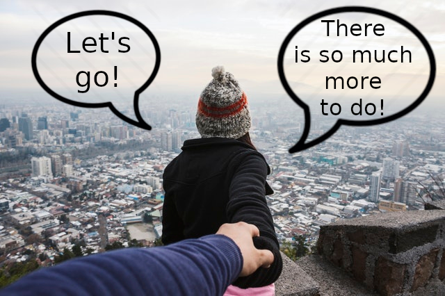
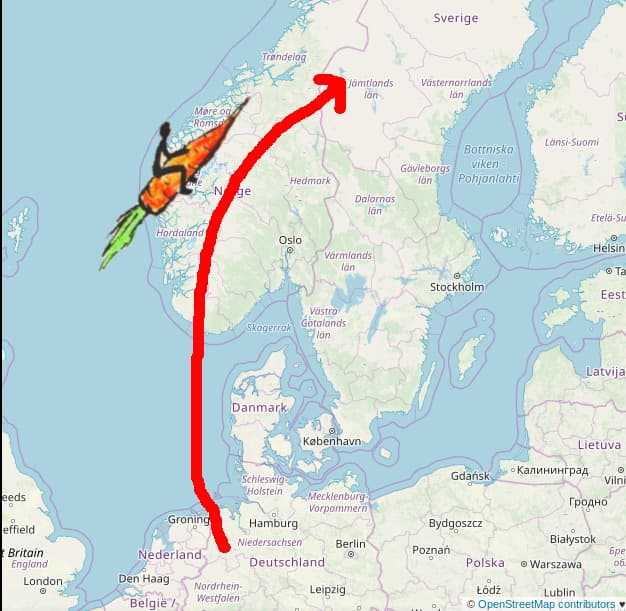

# The foodsaving grassroots movement

_the authors_

---

# Agenda

1. Introduction
2. Deep-dive
3. ...

---

# Introduction

_nothing here yet_

---

layout: true

  

---

# foodsharing.de

???
- biggest volunteer-based foodsaving initiative
- some idealist dumpster diver 7 years ago
- absurd to rummage through trash
- approached store owners, found some who agreed that it's a shame
- more stores, more volunteers, distribution needed
- quite complex pretty fast, so a foodsaver who happened to be a developer
- 50k foodsavers, 5k cooperating stores, 600 publicly accessible fsps and a team of volunteer coders

---

# Golden rules

  

???
- the golden rules are: (see slide)
- simple, positive, direct and empowering
- it's just natural to spread it further and further
- It already grew beyond the borders of Germany years ago
- nowadays extends more and more into areas where no German is spoken
- foodsharing.de - which is available in German only - cannot be used there
- but really, you don't need software to get started

---

# What software doesn't do

  
  <b style="margin-top: 200px">vs.</b>
  

???
- software doesn't help you build a real-life network of people
- what's needed is some time, some ideas and some determination to make this work
- get off your chair and out into the real world
- talk to people about food waste, form a first small group of like-minded individuals and gather the courage to contact stores at eye level
- may not be the easiest thing, but can theoretically be started tomorrow
- no need to ask someone for permission
- you can just take matters into your own hands and get active!
- but you don't need to get active alone...

---

# Yay community! :D

  

???
- in fact, you need people coming together for this to work
- in the end you need a whole community of foodsavers and eaters to make use of all the saved food
- so you want a good community spirit so that ppl want to come back
- and you want a core group of friends to coordinate everything
- cos everything is more fun if you do it together with friends
- and what is more fun is more stable, because you _like_ doing it

---

# How to find friends

  

???
- so how to find this core group of friends? How do people become friends?
- getting to know each other, spending time together and finding out to have something in common
- foodsaving offers all this through a common goal and a plan!
- Start with info events and communal cooking to spread the word, continue with building FSPs and cooperations
- for starters core group of maybe 5 foodsavers is more than enough
- if everyone is a bit open and friendly you will most definitely get along
- the more time you spend, the stronger your bond will grow
- So many things you can - and should! - do:
- Hangouts, brunches, communal cooking, movie screenings
- activities that are fun _and_ pr at the same time

---

# With a core group...

  

???
- everything's gonna be much easier
- You can share workloads and develop plans together,
- you can exchange ideas and form synergies,
- you can save food and have a jolly good time while at it.
- Foodsaving becomes a hobby and a lifestyle, something you just _do_
- underlying environmental and social reasons create a culture that can more easily spread and maintains itself
- Leads to more people feeling motivated and empowered to get further involved
- Leads to even more possible growth via more pr: info stands, distribution events, festival participation

---

# Catalyst effect

  

???
- Food waste is just one of many issues in this absurd world we live in today
- When people become foodsavers, they're normally interested in making the world a better place,
- when they participate for a while, they learn that they actually _can_ make a change
- positive, productive and practical environmental activists
- many similar topics in the sense of zero waste, upcycling, repairing and general environmentalism become obvious
- so do the many more similar forms of countering these, like:
  - Organizing free shops and free markets, clothes sharing parties, repair cafes, skill sharing sessions, etc.

---

# Internalization

  

???
- by living this logic for a while people's view of the world can change
- huge part of the material abundance we have is wasted simply bc it's cheaper
- it's a shame and an opportunity
- one can just ask and oftentimes save things instead of buying them
- enhanced awareness of one's own consumption creates clear preference to save, lend, buy 2nd hand - but _not_ buy new
- also works other way around:
- ownership of thousands of things is perceived as sinful burden rather than respectable accomplishment
- Products should be used and not amassed
- so everything that is not immediately needed by oneself gets shared with others
- such a worldview is still pretty uncommon
- differs from the normal, consumerist perspective quite a lot
- leads to normality ceasing to be a value in itself,
- and to an independent opinion taking hold.
- Living by these three values implies being–
  - an active problem-solver,
  - a creative free-thinker,
  - and having an independent, pragmatic conviction
- which I find is basically a hacker attitude...
- So how does it work to spread this idea?

---

# User story: foodsharing Östersund

  
  
Some months later:

  

???
- Teddy from Germany is a very active foodsaver going to Sweden for her studies
- She wants to spread the idea of foodsaving in her new city Östersund (50k inhabitants)
- She holds two info events to gather like-minded people (only 4-6 people show up)
- She creates two facebook groups to gather interested people and fellow foodsavers respectively
- She contacts stores to build up cooperations
- She contacts us and asks for help setting up a group on Karrot
- As soon as the cooperations are established the stores and pickups are put up on Karrot and people can sign up there

---

layout: true

  

---
class: big
# Karrot

Our foodsaving tool and community organizer!

  
  

???
Karrot is our contribution to help foodsaving groups grow.
It's a web app that gives each group their own space for organizing.
We have desktop and mobile versions, because we are often on the road when we save food.

In one sentence: think of it as a combination of a collaborative calender and a messaging system.

Now let's look a bit deeper what we can do on Karrot.

---
background-color: black
background-image: url(images/karrotost.png)
background-size: 90%

???
First, someone will create a group. Here's how the group start screen looks.
Then, they enter details about their co-operations, where and when they happen, if they happen regularly, how many people are needed and so on.

There's a list of food pickups and people can sign up for them.
As you can see here, all slots are already filled, which is very good!

We can also write messages to the whole group, to individual users or to those we do food pickups together with.

After doing the food pickup, we can give feedback how it went and how many kilos we saved.
This helps to spread information amongst team members.
We also get meaningful statistics.

To grow our group, we can invite others via email or let them apply for the group.
We can chat with them and invite them for a meeting in real-life before we accept them into the group.

---

# Karrot · Our goals

- serve many groups in different countries
- encourage do-ocratic participation
- let people work together

???
"Why is Karrot the way it is?"

When we work on Karrot development, our search for the best solution is guided by these goals.

We want to provide useful software for multiple groups which are different in many ways.
They come from different countries and have different rules, different language.

We want to encourage participation in groups, from all members.
Our model for this is "do-ocracy":
do something if you think it should be done and be excellent to each other.

We want to let people work together.
Our assumption is that people want to work together to make something great.
We want to make sure they can do that and no getting interrupted by destructive actions.

---

# Example: Group membership

  

???

"what's an example of the special karrot way?"

There are many design decisions in Karrot that I would like to talk about.
But there's not enough time in this talk, so I will just highlight one topic.
The group membership progress.

- you apply to join group
- group members interview you
- (your accept rules, you come to a real-life meeting)
- group member accepts your application
- you are newcomer
- you do pickups, meet people, give feedback
- others trust you
- you gain editing rights
- you set up new co-operations and drive the group forward

Newcomers have only limited rights until they gained the trust of other group members.
Active long-term members should all become editors.

This design has been inspired by the trust level of the Discourse forum software.

---

# Karrot · Comparison

  

Karrot has:

- independent groups
- multi-language and localization
- self-managing trust-based hierarchy
- feedback about pickups

???

"isn't there other software that does the same thing?"

Karrot has drawn a number of inspirations from other software.
Our main inspiration was foodsharing.de, with its dense network of foodsharing groups in German-speaking regions.
We made significant modifications to adapt it for worldwide use:

First, all groups are independent from each other.
This allows them to set their own rules, because the social and legal context of every country is different.

We added localization support, so that groups can use Karrot in their own language and timezone.

We use a self-managing trust-based hierarchy instead of manually assigning admin roles.

We added a system to provide feedback about food pickups.

---

# Karrot · Development

- our users actively give feedback and help with setting priorities
- unfunded
- no one except the developers and the users have a say on what should be done
- supported by saved food and various hackbases (&rarr; Kanthaus)

???

"how did you achieve it?"

...

--

## In future

- groups to spend some of their funds on Karrot
- formalize cooperative structure for development and karrot.world

???

...

---

# Karrot · Progress

- started in 2016
- has active users since mid-2017
- currently 16 active groups in 9 countries with 500 active users
- 50 food pickups per day

???

"what is the current state of Karrot?"

--

500 users in two years?

&rarr; fail! - _if we were a startup..._

But: **these people go out and save food every day!**

???

Startup: move fast and break things
Resilience: move slow and make things

---

# Karrot · Generalization

We can do more than foodsaving:

- bike saving &rarr; _Bike kitchen_ movement
- wood saving
- fruit from trees
- elderly care
- child care

???

"Can other fields benefit from Karrot as well?"
...

---
class: big
# Karrot · join us!

* our assembly &rarr; Hall 2, Kanthaus
* community forum &rarr; [community.foodsaving.world](https://community.foodsaving.world)
* foodsaving community stories &rarr; [foodsaving.today](https://foodsaving.today)
* start a group! &rarr; [karrot.world/#/group/create](https://karrot.world/#/group/create)
* contribute! &rarr; [github.com/yunity/karrot-frontend](https://github.com/yunity/karrot-frontend) <small>(Django, Vue)</small>

???

...
